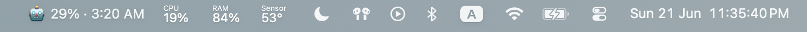

# custom-swiftbar-widgets

Personal [SwiftBar](https://github.com/swiftbar/SwiftBar) plugins.

## `claude-usage.5m.sh` — Claude subscription usage

Shows live Claude subscription usage in the menu bar — the same numbers
`/usage` reports, pulled from the OAuth usage endpoint:

- **🤖 42% · 3:15 PM** — current 5-hour (session) window usage + next reset
- Dropdown adds the weekly (7-day) window and its reset time

The access token is read from the macOS keychain (`Claude Code-credentials`).

### States

The menu bar always shows the robot, a percentage, and a reset time. When
usage data can't be fetched it falls back to `🤖 0% · idle`, and the dropdown
shows a one-line reason.

| Menu bar           | Meaning                                                              |
| ------------------ | -------------------------------------------------------------------- |
| `🤖 42% · 3:15 PM` | normal — session usage + reset time                                  |
| `🤖 0% · idle`     | no data — not logged in, unreachable, or rate-limited (see dropdown) |

### Install

1. Copy/symlink `claude-usage.5m.sh` into your SwiftBar plugin folder.
2. Make it executable: `chmod +x claude-usage.5m.sh`.
3. Refresh SwiftBar's plugin list (or restart SwiftBar) to pick it up.

### Polling interval

The filename is `claude-usage.5m.sh`. SwiftBar reads the `.5m.` suffix and
refreshes the widget every 5 minutes.

Each run is a network call to Anthropic's usage endpoint. The endpoint
**rate-limits bursts** — calling it several times in quick succession returns
`{"error": {"type": "rate_limit_error"}}` instead of usage. One call every
5 minutes stays well clear of that. If you shorten the interval and start
seeing `🤖 0% · idle`, you're polling too fast; back off.

> ⚠️ The OAuth usage endpoint is undocumented and may change. If it 401s,
> re-login to Claude Code; if it 404s, the path moved.
